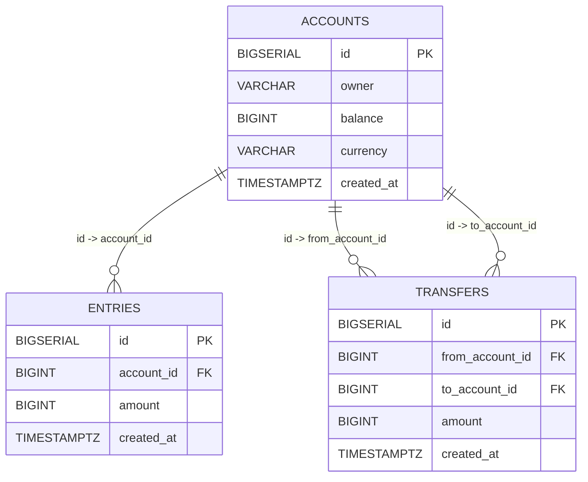

# Database Design

To make the basic functions run, simple bank supports at least services with three core functions: account management, balance tracking, and money transfers.

**Accounts Table**

Stores customer account information. Each account has a unique ID, owner name, balance, currency, and creation timestamp. An index on `owner` allows fast lookups by account holder.

**Entries Table**

Logs every change in account balance. Each entry references an account via `account_id`, and records the change amount (positive for deposit, negative for withdrawal) with a timestamp. An index on `account_id` supports efficient retrieval of an account's transaction history.

**Transfers Table**

Captures money movement between two accounts. Contains references to both source (`from_account_id`) and destination (`to_account_id`) accounts, the positive transfer amount, and a timestamp. Indexed on `from_account_id`, `to_account_id`, and their combination for quick queries of transfers by account or account pair.



Here's the [dbdiagram.io](https://dbdiagram.io/) script.

```sql
Table accounts as A{
 id bigserial [pk]
 owner varchar [not null]
 balance bigint [not null]
 currency varchar [not null]
 created_at timestamptz [not null, default: `now()`]

  Indexes {
    owner
  }
}

Table entries {
 id bigserial [pk]
 account_id bigint [ref: > A.id, not null]
 amount bigint [not null, note: 'can be negative or positive']
 created_at timestamptz [not null, default: `now()`]
   Indexes {
    account_id
  }
}

Table transfers {
 id bigserial [pk]
 from_account_id bigint [ref: > A.id, not null]
 to_account_id bigint [ref: > A.id, not null]
 amount bigint [not null, note: 'must be positive']
 created_at timestamptz [not null, default: `now()`]

 Indexes {
    from_account_id
    to_account_id
    (from_account_id, to_account_id)
  }
}
```
